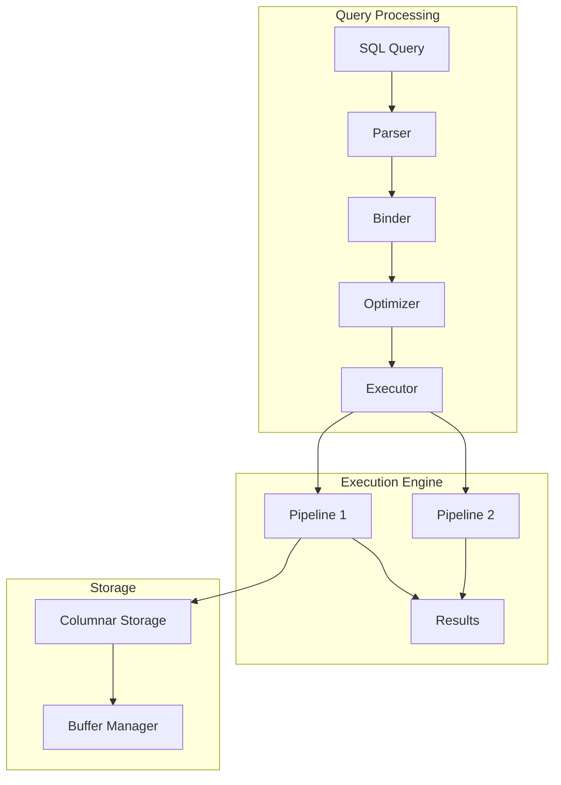

# Understanding DuckDB: Architecture and Core Concepts

*Part 1 of the DuckDB Deep Dive Series*

**Analysis based on commit:** [`52a07d06`](https://github.com/duckdb/duckdb/tree/52a07d06eafb63b60ed6275a494b85f93be4b986)

---

## What You'll Learn

- What DuckDB is and the problem it solves
- The pipeline-based columnar architecture
- How a query flows from SQL to results
- Key design trade-offs and their rationale

---

## Introduction

If you've worked with analytical workloads, you've likely faced a choice: use a heavyweight system like Spark or a traditional database like PostgreSQL. DuckDB offers a third path—an embeddable analytical database that runs in your process with no external dependencies.

Let's explore how DuckDB achieves this by examining its architecture from the ground up.

---

## The Core Problem

Analytical queries have fundamentally different access patterns than transactional queries:

**OLTP (Traditional):**
- Access few rows at a time
- Need fast point lookups
- Row-oriented storage is efficient

**OLAP (Analytical):**
- Scan millions of rows
- Aggregate entire columns
- Row-oriented storage wastes bandwidth

DuckDB is built specifically for OLAP workloads while remaining simple to deploy and integrate.

---

## Architectural Overview

DuckDB uses a **pipeline-based columnar architecture** with **vectorized execution**. Let's break that down:



### Columnar Storage

Data is stored column-by-column rather than row-by-row. This enables:

1. **Better compression**: Similar values compress well together
2. **Cache efficiency**: Sequential memory access for column scans
3. **Selective loading**: Only read columns needed for query

### Vectorized Execution

Instead of processing one row at a time, DuckDB processes batches of 2,048 values called **DataChunks**. This:

1. **Amortizes function call overhead**: One call processes many values
2. **Enables SIMD**: Modern CPUs can process multiple values per instruction
3. **Improves cache utilization**: Data stays in L1/L2 cache during processing

### Pipeline-Based Parallelism

Queries are broken into **pipelines** that can execute in parallel. Each pipeline is a sequence of operators that runs without intermediate materialization, reducing memory usage and improving locality.

---

## Query Execution Flow

Let's trace a simple query through the system:

```sql
SELECT name, SUM(amount)
FROM orders
WHERE status = 'completed'
GROUP BY name;
```

### Step 1: Parsing

The parser uses [libpg_query](https://github.com/duckdb/duckdb/tree/52a07d06eafb63b60ed6275a494b85f93be4b986/third_party/libpg_query), a fork of PostgreSQL's parser. This gives us battle-tested SQL parsing with PostgreSQL compatibility.

```cpp
// src/parser/parser.cpp
Parser parser;
parser.ParseQuery(query);
vector<unique_ptr<SQLStatement>> statements = parser.statements;
```

The parser produces an AST with statement types like `SelectStatement`, expression types like `ComparisonExpression`, and so on.

### Step 2: Binding

The binder performs semantic analysis—resolving table and column names, checking types, and producing bound expressions.

```cpp
// src/planner/binder.cpp
Binder binder(context);
auto bound_statement = binder.Bind(*statement);
```

At this point, abstract names become concrete references to catalog objects.

### Step 3: Planning

The planner converts the bound statement into a logical plan—a tree of relational algebra operators:

```
LogicalAggregate (GROUP BY name, SUM(amount))
    └── LogicalFilter (status = 'completed')
        └── LogicalGet (orders)
```

### Step 4: Optimization

The optimizer applies transformation rules to improve the plan. DuckDB includes 12+ optimization passes:

- **Filter pushdown**: Move filters closer to data sources
- **Column pruning**: Eliminate unused columns
- **Join ordering**: Find optimal join sequences
- **Statistics propagation**: Estimate cardinalities

```cpp
// src/optimizer/optimizer.cpp
Optimizer optimizer(*binder, context);
auto optimized_plan = optimizer.Optimize(std::move(plan));
```

### Step 5: Physical Planning

The optimized logical plan is converted to physical operators—specific algorithm implementations:

```
PhysicalHashAggregate
    └── PhysicalFilter
        └── PhysicalTableScan
```

### Step 6: Pipeline Construction

The executor analyzes the physical plan and constructs pipelines. A pipeline break occurs at operations that need to see all data before producing output (like aggregation or sorting).

```cpp
// src/execution/executor.cpp
void Executor::Initialize(PhysicalOperator &plan) {
    // Build pipeline structure
    // Identify parallelization opportunities
}
```

### Step 7: Execution

Pipelines execute with a pull-based model. The sink operator requests data, which propagates up to sources:

```cpp
// Simplified execution loop
while (true) {
    DataChunk chunk;
    source->GetChunk(chunk);
    if (chunk.size() == 0) break;

    // Process through operators
    for (auto &op : operators) {
        op->Execute(chunk);
    }

    sink->Sink(chunk);
}
```

---

## Key Design Decisions

### Decision 1: In-Process Architecture

**Trade-off**: Deployment simplicity vs. multi-tenant isolation

DuckDB runs in your application's process, like SQLite. This means:
- No network latency
- No separate server to manage
- Direct memory access to results
- But: No process isolation between users

**Why it fits**: Analytical workloads typically have few concurrent users and benefit more from low latency than isolation.

### Decision 2: PostgreSQL Parser

**Trade-off**: Parser control vs. compatibility

By using PostgreSQL's parser, DuckDB gets:
- Proven SQL parsing for complex queries
- Familiar syntax for users
- Compatibility with PostgreSQL tooling

But sacrifices:
- Complete control over grammar
- Ability to add non-PostgreSQL syntax easily

**Why it fits**: SQL compatibility is more valuable than custom syntax for most users.

### Decision 3: Pull-Based Execution

**Trade-off**: Simplicity vs. push optimization

DuckDB uses pull-based execution where operators request data from children:

```cpp
// Pull model
DataChunk chunk;
child->GetChunk(chunk);  // Parent pulls from child
```

Push-based systems can be more efficient for some patterns, but pull-based is:
- Easier to reason about
- Natural for pipelining
- Simpler to implement cancellation

### Decision 4: Morsel-Driven Parallelism

**Trade-off**: Parallelization granularity

DuckDB divides work into small "morsels" that threads can steal:

```cpp
// Work stealing approach
while (auto morsel = GetNextMorsel()) {
    ProcessMorsel(morsel);
}
```

Fine-grained morsels enable:
- Good load balancing
- Efficient use of all cores
- But: More synchronization overhead

---

## Core Abstractions

Let's look at the key types that tie the system together:

### ClientContext

Per-connection state including transaction, configuration, and query progress:

```cpp
// src/include/duckdb/main/client_context.hpp
class ClientContext {
    shared_ptr<DatabaseInstance> db;
    unique_ptr<Transaction> transaction;
    ClientConfig config;
    // ...
};
```

### Catalog

The metadata repository for all database objects:

```cpp
// src/include/duckdb/catalog/catalog.hpp
class Catalog {
    // Look up tables, functions, types
    CatalogEntry *GetEntry(const string &name);
};
```

### DataChunk

The fundamental data transfer unit between operators:

```cpp
// src/include/duckdb/common/types/data_chunk.hpp
class DataChunk {
    vector<Vector> data;  // Columns
    idx_t count;          // Row count (max 2048)
};
```

### PhysicalOperator

Base class for all execution operators:

```cpp
// src/include/duckdb/execution/physical_operator.hpp
class PhysicalOperator {
    virtual void GetChunk(DataChunk &chunk);
    vector<unique_ptr<PhysicalOperator>> children;
};
```

---

## Code Organization

The source code follows a clear modular structure:

```
src/
├── parser/      # SQL → AST
├── planner/     # AST → Logical Plan
├── optimizer/   # Plan optimization
├── execution/   # Physical operators
├── storage/     # Persistence
├── catalog/     # Metadata
├── transaction/ # MVCC
├── function/    # Built-in functions
├── common/      # Shared utilities
└── main/        # Entry points
```

Each module has a corresponding header directory in `src/include/duckdb/`.

---

## Key Takeaways

1. **DuckDB combines in-process simplicity with analytical performance** through columnar storage and vectorized execution

2. **The query pipeline** (Parse → Bind → Optimize → Execute) transforms SQL into efficient parallel execution plans

3. **Design decisions prioritize analytical workloads**: column orientation, batch processing, and OLAP optimizations

4. **Trade-offs are explicit**: in-process means no isolation, PostgreSQL parser means less grammar control, etc.

---

## Next Steps

In the next post, we'll dive deep into DuckDB's vectorized execution engine—exploring the DataChunk and Vector abstractions that make processing millions of rows efficient.

**Continue to Part 2: [Deep Dive into Vectorized Execution](02-deep-dive-vectorized-execution.md)**

---

## Further Reading

- [DuckDB Source Code](https://github.com/duckdb/duckdb/tree/52a07d06eafb63b60ed6275a494b85f93be4b986)
- [Database Entry Point](https://github.com/duckdb/duckdb/blob/52a07d06eafb63b60ed6275a494b85f93be4b986/src/main/database.cpp)
- [Executor Implementation](https://github.com/duckdb/duckdb/blob/52a07d06eafb63b60ed6275a494b85f93be4b986/src/execution/executor.cpp)
- [DuckDB Documentation](https://duckdb.org/docs/)
