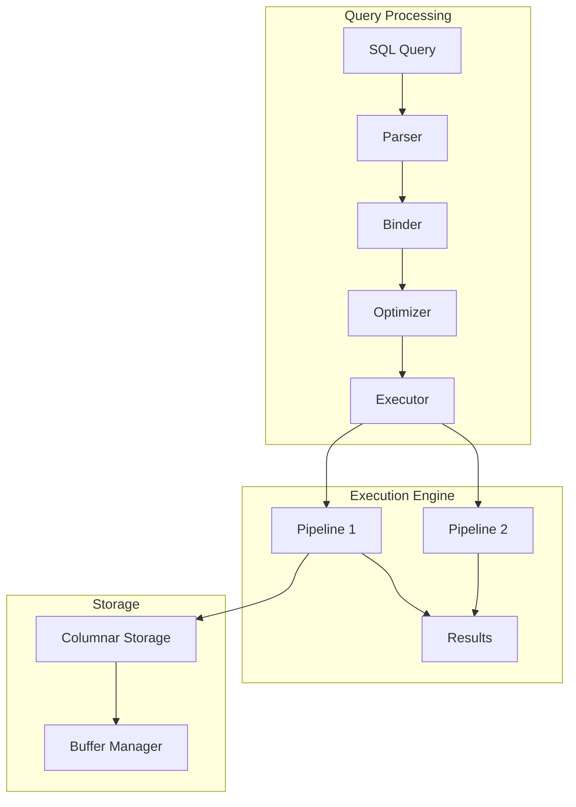

# Understanding DuckDB: Architecture and Core Concepts

*Part 1 of the DuckDB Deep Dive Series*

**Analysis based on commit:** [`52a07d06`](https://github.com/duckdb/duckdb/tree/52a07d06eafb63b60ed6275a494b85f93be4b986)

---

## What You'll Learn

- What DuckDB is and the problem it solves
- The pipeline-based columnar architecture
- How a query flows from SQL to results
- Key design trade-offs and their rationale
- Core abstractions that power the system

---

## Introduction

If you've worked with analytical workloads, you've likely faced a frustrating choice: use a heavyweight distributed system like Spark or Presto that requires cluster management, or repurpose a traditional database like PostgreSQL that wasn't designed for analytical patterns. DuckDB offers a compelling third path—an embeddable analytical database that runs in your application's process with zero external dependencies.

Think of it as "SQLite for analytics." Just as SQLite revolutionized embedded transactional databases, DuckDB aims to do the same for analytical workloads. You can pip install it, import it, and immediately start running complex analytical queries on gigabytes of data without any server setup.

But how does DuckDB achieve this? What architectural decisions enable it to process analytical queries so efficiently? Let's explore DuckDB's internals by examining its architecture from the ground up.

---

## The Core Problem: OLTP vs OLAP

To understand DuckDB's design, we first need to understand why analytical (OLAP) workloads need different treatment than transactional (OLTP) workloads.

### Transactional Workloads (OLTP)

Traditional databases like PostgreSQL, MySQL, and SQLite are optimized for transactions:

- **Access patterns**: Few rows at a time (INSERT one order, SELECT one user)
- **Operations**: Point lookups, small updates, index seeks
- **Storage need**: Row-oriented is efficient (all columns of a row stored together)
- **Example**: `SELECT * FROM users WHERE id = 12345`

When you fetch a single user by ID, having all columns stored contiguously means one disk read gets everything you need.

### Analytical Workloads (OLAP)

Analytical queries have fundamentally different patterns:

- **Access patterns**: Millions of rows at a time (aggregate all orders this month)
- **Operations**: Full table scans, aggregations, joins across large tables
- **Storage need**: Column-oriented is efficient (same column across rows stored together)
- **Example**: `SELECT region, SUM(amount) FROM orders WHERE date > '2024-01-01' GROUP BY region`

When aggregating a single column across millions of rows, row-oriented storage wastes enormous bandwidth reading columns you don't need.

### The Performance Gap

Consider a table with 100 columns and 10 million rows. To sum one column:

- **Row-oriented**: Must read all 100 columns × 10M rows = 1 billion column values
- **Column-oriented**: Read just 1 column × 10M rows = 10 million values

That's a 100x difference in I/O. Add compression benefits (similar values in a column compress better), and the gap widens further.

DuckDB is built specifically for OLAP workloads while remaining simple to deploy and integrate.

---

## Architectural Overview

DuckDB uses a **pipeline-based columnar architecture** with **vectorized execution**. Let's break down what each of these terms means:



### Columnar Storage

Data is stored column-by-column rather than row-by-row. For a table like:

```
| id | name  | amount |
|----|-------|--------|
| 1  | Alice | 100    |
| 2  | Bob   | 200    |
| 3  | Carol | 150    |
```

Row-oriented stores: `[1, Alice, 100], [2, Bob, 200], [3, Carol, 150]`
Column-oriented stores: `[1, 2, 3], [Alice, Bob, Carol], [100, 200, 150]`

This organization enables:

1. **Better compression**: Similar values (all integers, all strings) compress well together
2. **Cache efficiency**: Sequential memory access when scanning a column
3. **Selective loading**: Only read columns actually needed for the query
4. **SIMD operations**: Process multiple values with single CPU instructions

### Vectorized Execution

Instead of processing one row at a time (the "Volcano model" used by most databases), DuckDB processes batches of 2,048 values called **DataChunks**. This approach, pioneered by MonetDB/X100, provides:

1. **Amortized function call overhead**: One function call processes 2,048 values instead of 1
2. **SIMD enablement**: Modern CPUs can process 4-8 values per instruction with AVX
3. **Better cache utilization**: Data stays in L1/L2 cache during processing
4. **Reduced interpretation overhead**: Less time spent in dispatch loops

The 2,048 number isn't arbitrary—it's tuned to fit in L1 cache (2048 × 8 bytes = 16KB) while being large enough to amortize overhead.

### Pipeline-Based Parallelism

Queries are broken into **pipelines** that can execute in parallel. A pipeline is a sequence of operators that runs without intermediate materialization. Pipeline breaks occur at operations that need to see all input before producing output—like building a hash table for a join, or sorting.

This approach:
- Reduces memory usage (no large intermediate results)
- Improves cache locality (data flows through operators without spilling)
- Enables fine-grained parallelism (threads can work on different morsels)

---

## Query Execution Flow

Let's trace a query through the complete system to see how these components work together:

```sql
SELECT name, SUM(amount)
FROM orders
WHERE status = 'completed'
GROUP BY name;
```

### Step 1: Parsing

The parser uses [libpg_query](https://github.com/duckdb/duckdb/tree/52a07d06eafb63b60ed6275a494b85f93be4b986/third_party/libpg_query), a fork of PostgreSQL's parser. This gives us battle-tested SQL parsing with PostgreSQL compatibility—users can write familiar syntax and existing tools work out of the box.

```cpp
// src/parser/parser.cpp
Parser parser;
parser.ParseQuery(query);
vector<unique_ptr<SQLStatement>> statements = parser.statements;
```

The parser produces an Abstract Syntax Tree (AST) with nodes like `SelectStatement`, `ColumnRefExpression`, `ComparisonExpression`, and `FunctionExpression`. At this stage, names are just strings—we don't know if "orders" is a real table yet.

### Step 2: Binding

The binder performs semantic analysis—the crucial step of connecting syntax to meaning:

- Resolves table names to actual catalog entries
- Resolves column names to specific table columns
- Checks and infers types
- Expands wildcards (`SELECT *`)
- Validates function signatures

```cpp
// src/planner/binder.cpp
Binder binder(context);
auto bound_statement = binder.Bind(*statement);
```

After binding, `orders` becomes a reference to a specific `TableCatalogEntry`, and `amount` becomes a `BoundColumnRefExpression` with type information.

### Step 3: Planning

The planner converts the bound statement into a logical plan—a tree of relational algebra operators:

```
LogicalAggregate (GROUP BY name, SUM(amount))
    └── LogicalFilter (status = 'completed')
        └── LogicalGet (orders)
```

Each node represents a logical operation without specifying how it's implemented. `LogicalFilter` says "filter rows" but doesn't say whether to use an index or a sequential scan.

### Step 4: Optimization

The optimizer applies transformation rules to improve the plan. DuckDB includes 12+ optimization passes that run in sequence:

- **Expression simplification**: `1 + 1` → `2`, `x * 1` → `x`
- **Filter pushdown**: Move filters closer to data sources
- **Column pruning**: Eliminate columns not needed for output
- **Join ordering**: Find optimal sequence for multiple joins (crucial—can mean 1000x difference)
- **Statistics propagation**: Estimate cardinalities for cost-based decisions

```cpp
// src/optimizer/optimizer.cpp
Optimizer optimizer(*binder, context);
auto optimized_plan = optimizer.Optimize(std::move(plan));
```

### Step 5: Physical Planning

The optimized logical plan is converted to physical operators—specific algorithm implementations:

```
PhysicalHashAggregate    (hash-based grouping)
    └── PhysicalFilter   (vectorized predicate evaluation)
        └── PhysicalTableScan (columnar scan with zone map pruning)
```

The physical planner chooses:
- Hash join vs. merge join vs. nested loop
- Hash aggregate vs. sorted aggregate
- Sequential scan vs. index scan

### Step 6: Pipeline Construction

The executor analyzes the physical plan and constructs pipelines, identifying where data must be materialized:

```cpp
// src/execution/executor.cpp
void Executor::Initialize(PhysicalOperator &plan) {
    // Build pipeline structure
    // Identify parallelization opportunities
    // Create per-thread state
}
```

For our query:
- **Pipeline 1**: Scan → Filter → Hash Table Build (build the grouping hash table)
- **Pipeline 2**: Hash Table → Result (extract grouped results)

### Step 7: Execution

Pipelines execute with a pull-based model using morsel-driven parallelism:

```cpp
// Simplified execution loop
while (true) {
    DataChunk chunk;
    source->GetChunk(chunk);
    if (chunk.size() == 0) break;

    // Process through operators
    for (auto &op : operators) {
        op->Execute(chunk);
    }

    sink->Sink(chunk);
}
```

Multiple threads execute the same pipeline on different "morsels" (portions of the source data), with work stealing to balance load.

---

## Key Design Decisions and Trade-offs

Every architectural decision involves trade-offs. Let's examine DuckDB's choices:

### Decision 1: In-Process Architecture

**Trade-off**: Deployment simplicity vs. multi-tenant isolation

DuckDB runs in your application's process, like SQLite:
- **Pros**: Zero network latency, no server management, direct memory access, simple deployment
- **Cons**: No process isolation, single-writer model, memory shared with application

**Why it fits**: Analytical workloads typically have few concurrent users running large queries. The latency savings and operational simplicity outweigh multi-tenancy needs.

### Decision 2: PostgreSQL Parser

**Trade-off**: Parser control vs. compatibility

By forking PostgreSQL's parser:
- **Pros**: Battle-tested parsing, familiar syntax, tool compatibility
- **Cons**: Less control over grammar, harder to add non-PostgreSQL syntax

**Why it fits**: SQL compatibility is more valuable than custom syntax for most users. The PostgreSQL ecosystem is massive.

### Decision 3: Pull-Based Execution

**Trade-off**: Simplicity vs. push optimization potential

```cpp
// Pull model - parent requests from child
DataChunk chunk;
child->GetChunk(chunk);
```

- **Pros**: Easy to understand, natural for pipelining, simple cancellation
- **Cons**: Some patterns (like early termination) easier with push

**Why it fits**: Pull-based is simpler to implement correctly, and the performance difference is minimal with vectorization.

### Decision 4: Morsel-Driven Parallelism

**Trade-off**: Load balancing vs. synchronization overhead

Work is divided into small morsels that threads can steal:
- **Pros**: Excellent load balancing, scales well with cores
- **Cons**: Synchronization overhead, more complex state management

**Why it fits**: Modern machines have many cores; fine-grained parallelism utilizes them efficiently.

---

## Core Abstractions

Understanding these key types helps you navigate the codebase:

### ClientContext

Per-connection state including transaction, configuration, and progress tracking:

```cpp
// src/include/duckdb/main/client_context.hpp
class ClientContext {
    shared_ptr<DatabaseInstance> db;
    unique_ptr<Transaction> transaction;
    ClientConfig config;
    QueryProgress query_progress;
};
```

### Catalog

The metadata repository for all database objects (tables, views, functions, types):

```cpp
// src/include/duckdb/catalog/catalog.hpp
class Catalog {
    CatalogEntry *GetEntry(CatalogType type, const string &schema, const string &name);
    void CreateTable(CreateTableInfo &info);
};
```

### DataChunk

The fundamental data transfer unit—a batch of columns:

```cpp
// src/include/duckdb/common/types/data_chunk.hpp
class DataChunk {
    vector<Vector> data;  // One Vector per column
    idx_t count;          // Row count (max 2048)
};
```

### PhysicalOperator

Base class for all execution operators:

```cpp
// src/include/duckdb/execution/physical_operator.hpp
class PhysicalOperator {
    virtual SourceResultType GetData(ExecutionContext &context, DataChunk &chunk, OperatorSourceInput &input);
    vector<unique_ptr<PhysicalOperator>> children;
};
```

---

## Code Organization

The source code follows a clear modular structure:

```
src/
├── parser/      # SQL → AST (20K lines)
├── planner/     # AST → Logical Plan (18K lines)
├── optimizer/   # Plan optimization (25K lines)
├── execution/   # Physical operators (30K lines)
├── storage/     # Persistence layer (40K lines)
├── catalog/     # Metadata management (12K lines)
├── transaction/ # MVCC implementation (8K lines)
├── function/    # Built-in functions (45K lines)
├── common/      # Shared utilities (35K lines)
└── main/        # Entry points (10K lines)
```

Each module has corresponding headers in `src/include/duckdb/`.

---

## Key Takeaways

1. **DuckDB combines in-process simplicity with analytical performance** through columnar storage, vectorized execution, and pipeline parallelism

2. **The query pipeline** (Parse → Bind → Optimize → Execute) transforms SQL into efficient parallel execution plans

3. **Design decisions explicitly prioritize analytical workloads**: column orientation, batch processing, and OLAP optimizations over OLTP patterns

4. **Trade-offs are intentional**: in-process means no isolation, PostgreSQL parser means less grammar control, pull-based means simpler code

5. **Core abstractions (DataChunk, Vector, PhysicalOperator)** form the vocabulary for understanding the codebase

---

## Next Steps

In the next post, we'll dive deep into DuckDB's vectorized execution engine—exploring the DataChunk and Vector abstractions that make processing millions of rows efficient, and understanding why 2,048 is a magic number.

**Continue to Part 2: [Deep Dive into Vectorized Execution](02-deep-dive-vectorized-execution.md)**

---

## Further Reading

- [DuckDB Source Code](https://github.com/duckdb/duckdb/tree/52a07d06eafb63b60ed6275a494b85f93be4b986)
- [Database Entry Point](https://github.com/duckdb/duckdb/blob/52a07d06eafb63b60ed6275a494b85f93be4b986/src/main/database.cpp)
- [Executor Implementation](https://github.com/duckdb/duckdb/blob/52a07d06eafb63b60ed6275a494b85f93be4b986/src/execution/executor.cpp)
- [DuckDB Documentation](https://duckdb.org/docs/)
- ["MonetDB/X100: Hyper-Pipelining Query Execution"](http://cidrdb.org/cidr2005/papers/P19.pdf) - The paper that inspired vectorized execution
