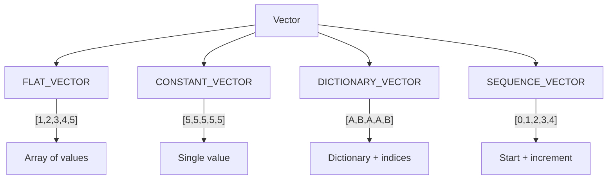

# Deep Dive into DuckDB's Vectorized Execution Engine

*Part 2 of the DuckDB Deep Dive Series*

**Analysis based on commit:** [`52a07d06`](https://github.com/duckdb/duckdb/tree/52a07d06eafb63b60ed6275a494b85f93be4b986)

---

## What You'll Learn

- How the DataChunk and Vector abstractions work
- Why DuckDB chose 2,048 elements per batch
- How expressions are executed over vectors
- Performance implications of vectorized execution

---

## Introduction

In the previous post, we saw that DuckDB processes data in batches of 2,048 values. But why that specific number? And how does this batching translate to real performance gains?

The answer lies in understanding how modern CPUs actually work. Modern processors are incredibly fast at arithmetic—they can perform billions of operations per second. But they're also incredibly bad at switching between tasks. Every time you call a function, branch on a condition, or access non-sequential memory, you pay a penalty that can be 10-100x more expensive than the actual computation.

Vectorized execution is a technique that restructures query processing to play to CPU strengths while avoiding weaknesses. Instead of processing one row at a time (calling functions, branching, jumping around memory), we process entire arrays in tight loops that the CPU can optimize with prefetching, branch prediction, and SIMD instructions.

Let's explore DuckDB's vectorized execution engine—the core innovation that enables analytical queries to run 5-50x faster than row-at-a-time processing.

---

## The Problem with Row-at-a-Time

Traditional database execution processes one row at a time:

```cpp
// Row-at-a-time (simplified)
for (auto &row : table) {
    if (row.status == "completed") {
        result += row.amount;
    }
}
```

This approach has three major issues:

1. **Function call overhead**: Each row requires function calls for evaluation
2. **Poor branch prediction**: CPU can't predict the filter outcome
3. **Cache misses**: Data for different columns scattered in memory

The result? Most time is spent on interpretation overhead, not actual computation.

---

## Vectorized Execution Model

DuckDB processes data in vectors—arrays of values from a single column:

```cpp
// Vectorized (simplified)
Vector status_col = GetColumn("status");
Vector amount_col = GetColumn("amount");

SelectionVector sel;
idx_t count = Filter(status_col, "completed", sel);
result = Sum(amount_col, sel, count);
```

This approach:

1. **Amortizes overhead**: One function call processes 2,048 values
2. **Enables SIMD**: Process 4-8 values per CPU instruction
3. **Improves locality**: Sequential memory access patterns

---

## The DataChunk Abstraction

A DataChunk represents a batch of rows organized as columns:

```cpp
// src/include/duckdb/common/types/data_chunk.hpp
class DataChunk {
public:
    //! The vectors that make up the data chunk
    vector<Vector> data;
    //! The number of tuples in the chunk
    idx_t count;

    //! Maximum chunk size
    static constexpr idx_t STANDARD_VECTOR_SIZE = 2048;
};
```

The actual vector size constant is defined in:
[`src/include/duckdb/common/vector_size.hpp:16`](https://github.com/duckdb/duckdb/blob/52a07d06eafb63b60ed6275a494b85f93be4b986/src/include/duckdb/common/vector_size.hpp#L16)

```cpp
#ifndef STANDARD_VECTOR_SIZE
#define STANDARD_VECTOR_SIZE 2048
#endif
```

### Why 2,048?

This magic number balances several constraints:

1. **L1 cache size**: 2048 × 8 bytes = 16KB fits in most L1 caches
2. **SIMD alignment**: Power of 2 for efficient SIMD operations
3. **Overhead amortization**: Large enough to make function calls negligible
4. **Memory efficiency**: Small enough to avoid excessive allocation

The choice isn't arbitrary—it's been tuned through benchmarking on real hardware.

---

## The Vector Abstraction

A Vector stores values for a single column within a DataChunk:

```cpp
// src/include/duckdb/common/types/vector.hpp
class Vector {
public:
    //! The vector type (FLAT, CONSTANT, DICTIONARY, SEQUENCE)
    VectorType vector_type;
    //! The logical type of the vector
    LogicalType type;
    //! The data pointer
    data_ptr_t data;
    //! Validity mask for NULL tracking
    ValidityMask validity;
};
```

### Vector Types

DuckDB uses different vector representations for efficiency:



**FLAT_VECTOR**: Standard array of values—used for most operations.

**CONSTANT_VECTOR**: All elements have the same value—common in expressions like `WHERE status = 'completed'`.

**DICTIONARY_VECTOR**: Values stored as dictionary indices—enables processing without decompression.

**SEQUENCE_VECTOR**: Arithmetic sequence—efficient for row numbers and ranges.

---

## UnifiedVectorFormat

Different vector types need uniform access. UnifiedVectorFormat provides this:

```cpp
// src/include/duckdb/common/types/vector.hpp
struct UnifiedVectorFormat {
    //! Selection vector mapping logical to physical positions
    const SelectionVector *sel;
    //! Data pointer
    data_ptr_t data;
    //! Validity mask
    ValidityMask *validity;
    //! Number of entries
    idx_t count;
};
```

Any vector type can be converted to UnifiedVectorFormat:

```cpp
Vector vec;
UnifiedVectorFormat format;
vec.ToUnifiedFormat(count, format);

// Now access uniformly
for (idx_t i = 0; i < count; i++) {
    idx_t idx = format.sel->get_index(i);
    if (format.validity->RowIsValid(idx)) {
        auto value = ((int32_t *)format.data)[idx];
        // process value
    }
}
```

This abstraction lets operators work with any vector type without type-specific code paths.

---

## Expression Execution

The ExpressionExecutor evaluates expressions over DataChunks:

```cpp
// src/execution/expression_executor.cpp
void ExpressionExecutor::Execute(DataChunk &chunk, Vector &result) {
    // For each expression in the execution tree
    // Recursively evaluate operands
    // Apply the operation vectorized
}
```

### Example: Addition

Let's trace `a + b` through vectorized execution:

```cpp
// src/include/duckdb/common/operator/numeric_binary_operators.hpp
template <class OP>
static void ExecuteLoop(Vector &left, Vector &right, Vector &result, idx_t count) {
    auto ldata = FlatVector::GetData<T>(left);
    auto rdata = FlatVector::GetData<T>(right);
    auto result_data = FlatVector::GetData<T>(result);

    // Tight loop - SIMD friendly
    for (idx_t i = 0; i < count; i++) {
        result_data[i] = OP::Operation(ldata[i], rdata[i]);
    }
}
```

The compiler can vectorize this loop using SIMD instructions, processing multiple elements per cycle.

### Handling NULLs

NULL handling uses validity masks instead of per-value checks:

```cpp
// Combine validity masks
result_validity = left_validity & right_validity;

// Process only valid entries (or all if we know there are no NULLs)
if (left.IsValid() && right.IsValid()) {
    // Fast path - no NULL checks needed
    ExecuteLoopNoNull(...);
} else {
    // Slow path - check validity
    ExecuteLoopWithNull(...);
}
```

This avoids branch mispredictions by processing NULLs in bulk.

---

## Selection Vectors

Filtering doesn't copy data—it creates a selection vector:

```cpp
// Selection vector contains indices of matching rows
class SelectionVector {
    sel_t *sel_vector;  // Array of indices

    inline idx_t get_index(idx_t idx) const {
        return sel_vector[idx];
    }
};
```

When we filter `WHERE status = 'completed'`:

```cpp
// Before: [0,1,2,3,4,5,6,7] (all rows)
// After:  [1,3,5,7]         (only matching rows)
```

Subsequent operators use the selection vector to skip non-matching rows without physically removing them. This avoids expensive data copying.

---

## Pipeline Execution

Pipelines chain operators together for cache-efficient execution:

```cpp
// src/parallel/pipeline.cpp
void PipelineExecutor::Execute() {
    DataChunk chunk;
    while (true) {
        // Get data from source
        source->GetChunk(context, chunk);
        if (chunk.size() == 0) break;

        // Process through operators
        for (auto &op : operators) {
            op->Execute(chunk);
        }

        // Send to sink
        sink->Sink(context, chunk);
    }
}
```

Data flows through the pipeline without intermediate materialization, staying in CPU cache.

---

## Performance Impact

Let's quantify the vectorization benefit with a concrete example:

### Row-at-a-Time

```cpp
// ~20 instructions per row
for each row:
    load row pointer         // 1
    load column offset       // 1
    compute address          // 1
    load value               // 1
    check null               // 2 (branch)
    apply operation          // 1
    store result             // 1
    update loop counter      // 1
    check loop condition     // 2 (branch)
```

For 1 million rows: ~20M instructions

### Vectorized

```cpp
// Setup: ~20 instructions
load column pointers
setup SIMD registers

// Per batch: ~20 + count/8 instructions
for each batch of 2048:
    SIMD loop (processes 8 at a time): 256 iterations
    validity mask check: 1
```

For 1 million rows: ~20K + 256K × 500 ≈ 150K instructions

**Speedup: ~100x fewer instructions**, plus better cache utilization and branch prediction.

---

## Real-World Example

Let's trace a complete query through vectorized execution:

```sql
SELECT SUM(price * quantity)
FROM orders
WHERE status = 'shipped';
```

### Step 1: Table Scan

The scan operator produces DataChunks from storage:

```cpp
// Read columns: price, quantity, status
DataChunk chunk;
chunk.data[0] = price_column;    // Vector of doubles
chunk.data[1] = quantity_column; // Vector of integers
chunk.data[2] = status_column;   // Vector of strings
```

### Step 2: Filter

The filter creates a selection vector for matching rows:

```cpp
// Compare status to 'shipped'
SelectionVector sel;
idx_t match_count = VectorOperations::Equals(
    status_col, "shipped", sel);
chunk.Slice(sel, match_count);
```

### Step 3: Projection

Compute `price * quantity` vectorized:

```cpp
// Multiply vectors element-wise
Vector result;
VectorOperations::Multiply(price_col, quantity_col, result, count);
```

### Step 4: Aggregation

Sum the result vector:

```cpp
// Vectorized sum
double total = VectorOperations::Sum(result, count);
```

Each step processes 2,048 values at a time, maintaining cache locality throughout.

---

## Advanced: Compressed Execution

One of DuckDB's most powerful optimizations is executing operations directly on compressed data without decompression. This is possible because of the dictionary and constant vector types.

### Dictionary-Encoded Execution

```cpp
// Dictionary-encoded vector
// Instead of: ["red","blue","red","red","blue"]
// Store: dictionary=["red","blue"], indices=[0,1,0,0,1]

// Filter on dictionary first
idx_t dict_match = FindInDictionary(dictionary, "red");
// Then just compare indices (integers, not strings)
VectorOperations::Equals(indices, dict_match, sel);
```

This avoids decompression entirely for filtering operations. String comparison becomes integer comparison—orders of magnitude faster.

### Constant Vector Optimization

When you filter with a constant (e.g., `WHERE status = 'shipped'`), DuckDB represents `'shipped'` as a CONSTANT_VECTOR rather than repeating the value 2,048 times. Operations on constant vectors can often be reduced to a single operation:

```cpp
// a + 5 where 5 is constant
// Instead of adding 5 to each element individually:
// Just store the constant and apply it during result materialization
```

### Late Materialization

DuckDB delays converting to flat vectors as long as possible. A query might flow through multiple operators with data still dictionary-encoded, only materializing at the final output. This keeps memory bandwidth low and operations fast throughout the pipeline.

---

## Key Takeaways

1. **Vectorized execution processes 2,048 values per batch**, amortizing function call overhead and enabling SIMD

2. **Vector types (FLAT, CONSTANT, DICTIONARY, SEQUENCE)** provide flexibility while UnifiedVectorFormat enables uniform access

3. **Selection vectors avoid data copying** by tracking which rows match predicates

4. **Pipeline execution maintains cache locality** by streaming data through operators without materialization

5. **The 2,048 batch size balances** L1 cache utilization, SIMD efficiency, and overhead amortization

---

## Next Steps

In the next post, we'll explore the design patterns and practices used throughout DuckDB—from error handling to testing philosophy.

**Continue to Part 3: [Patterns and Practices](03-patterns-practices.md)**

---

## Further Reading

- [Vector Implementation](https://github.com/duckdb/duckdb/blob/52a07d06eafb63b60ed6275a494b85f93be4b986/src/include/duckdb/common/types/vector.hpp)
- [DataChunk Implementation](https://github.com/duckdb/duckdb/blob/52a07d06eafb63b60ed6275a494b85f93be4b986/src/include/duckdb/common/types/data_chunk.hpp)
- [Expression Executor](https://github.com/duckdb/duckdb/blob/52a07d06eafb63b60ed6275a494b85f93be4b986/src/execution/expression_executor.cpp)
- ["MonetDB/X100: Hyper-Pipelining Query Execution"](http://cidrdb.org/cidr2005/papers/P19.pdf) - The paper that inspired vectorized execution
