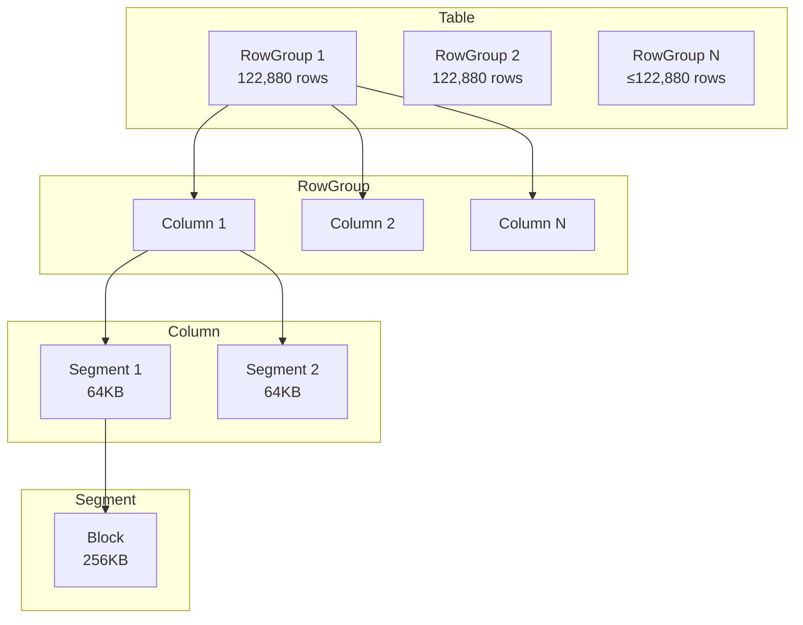
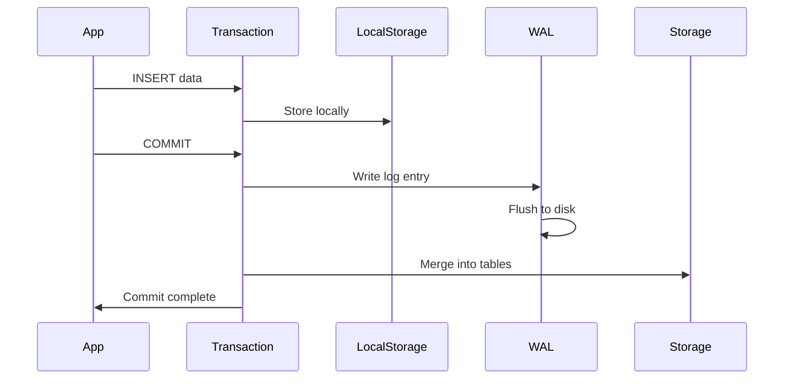

# DuckDB Storage Engine Deep Dive

*Part 4 of the DuckDB Deep Dive Series*

**Analysis based on commit:** [`52a07d06`](https://github.com/duckdb/duckdb/tree/52a07d06eafb63b60ed6275a494b85f93be4b986)

---

## What You'll Learn

- How DuckDB organizes data on disk
- The compression algorithms used and when each applies
- Buffer management and caching
- Transaction handling with MVCC
- Write-ahead logging for durability

---

## Introduction

DuckDB's storage engine is designed for analytical workloads—optimizing for sequential scans and aggregations rather than point lookups. Let's explore how data is organized, compressed, and retrieved efficiently.

---

## Storage Hierarchy

DuckDB uses a hierarchical storage structure:



### Levels Explained

**Table**: The top-level container, partitioned horizontally into RowGroups.

**RowGroup**: A horizontal partition containing ~122,880 rows (tunable). Each RowGroup stores column data independently, enabling:
- Parallel processing
- Incremental loading
- Zone maps (min/max statistics)

```cpp
// src/include/duckdb/storage/table/row_group.hpp
class RowGroup {
    vector<shared_ptr<ColumnData>> columns;
    idx_t start;  // Starting row index
    idx_t count;  // Number of rows
    RowGroupStatistics stats;  // Min/max per column
};
```

**Column**: Vertical slice of a RowGroup, divided into segments.

**Segment**: A contiguous piece of column data, typically 64KB compressed. Each segment can use different compression.

```cpp
// src/include/duckdb/storage/table/column_segment.hpp
class ColumnSegment {
    CompressionType compression_type;
    idx_t count;
    idx_t start;
    shared_ptr<BlockHandle> block;
};
```

**Block**: Fixed-size storage unit (256KB default). The granularity for disk I/O and buffer pool management.

---

## Compression Algorithms

DuckDB employs 14+ compression algorithms, automatically selecting the best for each segment:

### Integer Compression

| Algorithm | Best For | Compression Ratio |
|-----------|----------|-------------------|
| **Bitpacking** | Small value ranges | High |
| **Frame of Reference (FOR)** | Clustered values | High |
| **PFOR-Delta** | Sorted/sequential | Very High |
| **RLE** | Many repeated values | Variable |

### String Compression

| Algorithm | Best For | Compression Ratio |
|-----------|----------|-------------------|
| **Dictionary** | Low cardinality | Very High |
| **FSST** | General strings | Good |

### Floating Point Compression

| Algorithm | Best For | Compression Ratio |
|-----------|----------|-------------------|
| **ALP** | General floats | Good |
| **Chimp** | Time series | Very High |

### General

| Algorithm | Use Case |
|-----------|----------|
| **Constant** | All same value |
| **Uncompressed** | Random data |
| **Zstd** | Fallback for poor compression |

### Compression Selection

DuckDB analyzes each segment to choose the best algorithm:

```cpp
// Simplified selection logic
CompressionType SelectCompression(ColumnSegment &segment) {
    // Check for constant
    if (AllSameValue(segment)) return CONSTANT;

    // Check for RLE potential
    if (HighRunLength(segment)) return RLE;

    // For integers, try bitpacking
    if (IsInteger(segment.type)) {
        auto width = BitWidth(segment);
        if (width < 32) return BITPACKING;
    }

    // For strings, try dictionary
    if (IsString(segment.type)) {
        if (Cardinality(segment) < threshold) return DICTIONARY;
    }

    // Fallback
    return UNCOMPRESSED;
}
```

---

## Lazy Decompression

DuckDB avoids decompression when possible:

```cpp
// Dictionary-encoded column
// Storage: dictionary=["red","blue","green"], indices=[0,1,0,2,1]

// Query: WHERE color = 'red'
// Instead of decompressing all strings:
idx_t dict_idx = FindInDictionary("red");  // Find once
// Then just compare indices (integers)
Filter(indices, dict_idx);  // Fast integer comparison
```

This keeps data compressed during filtering, only decompressing for output.

---

## Buffer Management

The BufferManager handles memory and disk I/O:

```cpp
// src/storage/buffer/buffer_manager.cpp
class BufferManager {
public:
    //! Total memory budget
    idx_t maximum_memory;
    //! Current memory usage
    atomic<idx_t> current_memory;
    //! Buffer pool (LRU cache)
    BufferPool pool;

    //! Pin a block in memory
    BufferHandle Pin(BlockHandle &handle);
    //! Unpin to allow eviction
    void Unpin(BlockHandle &handle);
};
```

### Pin/Unpin Model

Operators pin blocks they're using:

```cpp
// Reading a column segment
auto handle = buffer_manager.Pin(segment.block);
// Access data through handle
auto data = handle.Ptr();
// Process data...
// Automatically unpinned when handle goes out of scope
```

### LRU Eviction

When memory is full, least-recently-used blocks are evicted:

```cpp
void BufferManager::Evict() {
    while (current_memory > maximum_memory) {
        auto victim = pool.GetLRUBlock();
        if (victim->IsDirty()) {
            WriteToFile(victim);
        }
        pool.Remove(victim);
        current_memory -= victim->size;
    }
}
```

### Temporary Storage

Intermediate results that don't fit in memory spill to disk:

```cpp
// Large sort operation
SortState sort_state(buffer_manager);
sort_state.AddChunk(chunk);  // May spill if memory full
sort_state.Sort();           // Merge spilled runs
```

---

## Transaction Management

DuckDB implements MVCC (Multi-Version Concurrency Control) for snapshot isolation.

### Transaction State

```cpp
// src/include/duckdb/transaction/transaction.hpp
class Transaction {
    transaction_t transaction_id;   // Unique ID
    transaction_t start_time;       // Snapshot timestamp
    LocalStorage local_storage;     // Uncommitted changes
    UndoBuffer undo_buffer;         // Rollback data
};
```

### LocalStorage

Uncommitted changes are stored per-transaction:

```cpp
// src/include/duckdb/transaction/local_storage.hpp
class LocalStorage {
    // Pending inserts
    unordered_map<DataTable *, LocalTableStorage> tables;

    // Write to local storage (not visible to others)
    void Append(DataTable &table, DataChunk &chunk);

    // On commit: merge into global storage
    void Commit();

    // On rollback: discard
    void Rollback();
};
```

This enables:
- Writers don't block readers
- Readers see consistent snapshots
- Fast rollback (just discard LocalStorage)

### Visibility Checks

Each row version has transaction metadata:

```cpp
// Check if row is visible to current transaction
bool IsVisible(Transaction &txn, RowVersion &version) {
    // Created before our snapshot?
    if (version.created_by > txn.start_time) return false;
    // Not deleted, or deleted after our snapshot?
    if (version.deleted_by == 0 ||
        version.deleted_by > txn.start_time) return true;
    return false;
}
```

---

## Write-Ahead Logging

DuckDB uses WAL for durability:

```cpp
// src/storage/wal/write_ahead_log.cpp
class WriteAheadLog {
    // Append entry to log
    void WriteEntry(WALEntry &entry);

    // Flush to disk
    void Flush();

    // Replay after crash
    void Replay(DatabaseInstance &db);
};
```

### Write Path



### Checkpointing

Periodic checkpoints merge WAL into main storage:

```cpp
// src/storage/checkpoint/checkpoint_manager.cpp
void CheckpointManager::CreateCheckpoint() {
    // Write all dirty data to main file
    WriteTableData();

    // Truncate WAL
    wal.Truncate();

    // Update metadata
    WriteMetadata();
}
```

After checkpoint, WAL can be discarded because all data is in main storage.

---

## Statistics and Zone Maps

Each RowGroup maintains statistics for query optimization:

```cpp
// src/storage/statistics/base_statistics.hpp
class BaseStatistics {
    bool has_null;
    idx_t distinct_count;  // Approximate
};

class NumericStatistics : public BaseStatistics {
    Value min;
    Value max;
};

class StringStatistics : public BaseStatistics {
    string min;
    string max;
};
```

### Zone Map Filtering

Statistics enable skipping irrelevant RowGroups:

```sql
SELECT * FROM orders WHERE amount > 1000;
```

```cpp
// Check each RowGroup
for (auto &row_group : table.row_groups) {
    auto &stats = row_group.GetStatistics("amount");
    // Skip if max < 1000
    if (stats.max < 1000) continue;
    // Scan this RowGroup
    ScanRowGroup(row_group);
}
```

This can skip entire RowGroups without reading data.

---

## Storage File Format

DuckDB uses a single-file format:

```
┌──────────────────────────┐
│      File Header         │
├──────────────────────────┤
│      Metadata Block      │
├──────────────────────────┤
│      Data Block 1        │
├──────────────────────────┤
│      Data Block 2        │
├──────────────────────────┤
│         ...              │
├──────────────────────────┤
│      Data Block N        │
├──────────────────────────┤
│      Free List           │
└──────────────────────────┘
```

### Header Structure

```cpp
struct DatabaseHeader {
    uint64_t magic_number;      // DuckDB identifier
    uint64_t version;           // Format version
    uint64_t block_size;        // Default 256KB
    idx_t metadata_block;       // Pointer to metadata
    idx_t free_list;            // Free block list
};
```

### Block Allocation

Free blocks are tracked for reuse:

```cpp
class BlockManager {
    // Get a free block
    block_id_t GetFreeBlock();

    // Return block to free list
    void FreeBlock(block_id_t block);
};
```

---

## Concurrent Access

### Read-Write Locking

DuckDB uses a single-writer model:

```cpp
// Multiple readers OR one writer
class ReadWriteLock {
    void ReadLock();   // Multiple allowed
    void WriteLock();  // Exclusive
};
```

This simplifies implementation while supporting common use cases.

### Optimistic Concurrency

Most operations are optimistic:

```cpp
// Try operation without locking
if (TryOptimistic()) {
    return;
}
// Fall back to locking
Lock();
PerformOperation();
Unlock();
```

---

## Key Takeaways

1. **Hierarchical storage** (Table → RowGroup → Column → Segment → Block) enables efficient columnar access and parallel processing

2. **Automatic compression selection** analyzes each segment to choose from 14+ algorithms

3. **Lazy decompression** keeps data compressed during filtering, only decompressing for output

4. **MVCC with LocalStorage** provides snapshot isolation without blocking readers

5. **Zone maps** enable skipping entire RowGroups based on min/max statistics

6. **Single-file format** simplifies deployment while maintaining good performance

---

## Next Steps

In the next post, we'll explore how to extend DuckDB—adding custom functions, creating extensions, and integrating with your applications.

**Continue to Part 5: [Extending and Integrating DuckDB](05-extending-integrating.md)**

---

## Further Reading

- [Storage Manager](https://github.com/duckdb/duckdb/blob/52a07d06eafb63b60ed6275a494b85f93be4b986/src/storage/storage_manager.cpp)
- [Buffer Manager](https://github.com/duckdb/duckdb/blob/52a07d06eafb63b60ed6275a494b85f93be4b986/src/storage/buffer/buffer_manager.cpp)
- [RowGroup Implementation](https://github.com/duckdb/duckdb/blob/52a07d06eafb63b60ed6275a494b85f93be4b986/src/storage/table/row_group.cpp)
- [Compression Algorithms](https://github.com/duckdb/duckdb/tree/52a07d06eafb63b60ed6275a494b85f93be4b986/src/storage/compression)
