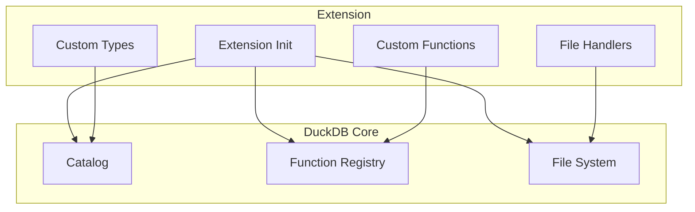

# Extending and Integrating DuckDB

*Part 5 of the DuckDB Deep Dive Series*

**Analysis based on commit:** [`52a07d06`](https://github.com/duckdb/duckdb/tree/52a07d06eafb63b60ed6275a494b85f93be4b986)

---

## What You'll Learn

- How DuckDB's extension system works
- Adding custom scalar, aggregate, and table functions
- Integration patterns for different use cases
- API design and client library overview
- Real-world extension examples

---

## Introduction

One of DuckDB's greatest strengths is its extensibility. While the core engine handles SQL parsing, query optimization, and vectorized execution, much of the functionality that makes DuckDB useful—Parquet support, JSON functions, spatial operations—lives in extensions.

This isn't just about plugins. DuckDB is designed from the ground up to be embedded and extended. The same extension system that enables built-in features like Parquet support also enables you to add custom functions for your domain, integrate with proprietary file formats, or connect to external data sources.

The extension architecture follows a clear philosophy: extensions should feel native. A function you add should be indistinguishable from a built-in function. It gets the same optimization treatment, the same error handling, the same documentation. This seamless integration is what makes DuckDB a practical platform for building analytical applications.

In this post, we'll explore the extension architecture, walk through adding different types of functions, examine integration patterns for common use cases, and look at how to create your own extension from scratch.

Let's start by understanding how extensions interact with DuckDB's core components.

---

## Extension Architecture

Extensions are dynamically loadable modules that register new capabilities:



### Extension Types

DuckDB supports three types of extensions, each suited to different deployment scenarios:

1. **Built-in Extensions**: Compiled directly into the DuckDB binary. These include parquet, json, and icu. They're always available, load instantly, and have no version compatibility concerns. The trade-off is binary size—each built-in extension increases the DuckDB library size.

2. **Loadable Extensions**: Separate shared libraries (.duckdb_extension files) that are loaded at runtime with the `LOAD` command or automatically from the extension repository. This is the most flexible option—you can add functionality without recompiling DuckDB, and users can choose which extensions they need.

3. **WebAssembly Extensions**: For browser environments where native shared libraries aren't available. These are compiled to WebAssembly and loaded by DuckDB-Wasm. They enable the same extension ecosystem in web applications.

### Extension Interface

Every extension implements a standard interface:

```cpp
// Extension entry point
extern "C" {
DUCKDB_EXTENSION_API void my_extension_init(duckdb::DatabaseInstance &db) {
    // Register functions, types, etc.
}

DUCKDB_EXTENSION_API const char *my_extension_version() {
    return DuckDB::LibraryVersion();
}
}
```

---

## Adding Custom Functions

### Scalar Functions

Scalar functions operate on individual values:

```cpp
// Example: DOUBLE_IT(x) returns x * 2
static void DoubleItFunction(DataChunk &args,
                             ExpressionState &state,
                             Vector &result) {
    auto &input = args.data[0];
    auto count = args.size();

    // Get input data
    UnifiedVectorFormat input_data;
    input.ToUnifiedFormat(count, input_data);
    auto input_ptr = (int64_t *)input_data.data;

    // Get result data
    auto result_ptr = FlatVector::GetData<int64_t>(result);

    // Process vectorized
    for (idx_t i = 0; i < count; i++) {
        auto idx = input_data.sel->get_index(i);
        result_ptr[i] = input_ptr[idx] * 2;
    }
}

// Register the function
void RegisterDoubleIt(DatabaseInstance &db) {
    auto function = ScalarFunction(
        "double_it",                          // Name
        {LogicalType::BIGINT},                // Arguments
        LogicalType::BIGINT,                  // Return type
        DoubleItFunction                      // Implementation
    );

    ExtensionUtil::RegisterFunction(db, function);
}
```

### Aggregate Functions

Aggregate functions combine multiple values:

```cpp
// Example: PRODUCT aggregate (multiply all values)
struct ProductState {
    int64_t product;
    bool is_set;
};

static void ProductUpdate(Vector inputs[],
                          AggregateInputData &input_data,
                          idx_t count,
                          Vector &state_vector) {
    auto &input = inputs[0];
    UnifiedVectorFormat input_data;
    input.ToUnifiedFormat(count, input_data);
    auto input_ptr = (int64_t *)input_data.data;

    auto states = FlatVector::GetData<ProductState *>(state_vector);

    for (idx_t i = 0; i < count; i++) {
        auto &state = *states[i];
        auto idx = input_data.sel->get_index(i);

        if (!state.is_set) {
            state.product = input_ptr[idx];
            state.is_set = true;
        } else {
            state.product *= input_ptr[idx];
        }
    }
}

static void ProductFinalize(Vector &state_vector,
                           AggregateInputData &input_data,
                           Vector &result,
                           idx_t count) {
    auto states = FlatVector::GetData<ProductState *>(state_vector);
    auto results = FlatVector::GetData<int64_t>(result);

    for (idx_t i = 0; i < count; i++) {
        results[i] = states[i]->product;
    }
}
```

### Table Functions

Table functions produce result sets:

```cpp
// Example: GENERATE_EVEN_NUMBERS(n) returns 0, 2, 4, ..., 2*(n-1)
struct EvenNumbersData : public TableFunctionData {
    idx_t n;
    idx_t current;
};

static unique_ptr<FunctionData> EvenNumbersBind(
    ClientContext &context,
    TableFunctionBindInput &input,
    vector<LogicalType> &return_types,
    vector<string> &names) {

    auto result = make_uniq<EvenNumbersData>();
    result->n = input.inputs[0].GetValue<int64_t>();
    result->current = 0;

    return_types.push_back(LogicalType::BIGINT);
    names.push_back("even_number");

    return std::move(result);
}

static void EvenNumbersFunction(ClientContext &context,
                                TableFunctionInput &data,
                                DataChunk &output) {
    auto &state = data.bind_data->Cast<EvenNumbersData>();

    idx_t count = 0;
    auto result = FlatVector::GetData<int64_t>(output.data[0]);

    while (state.current < state.n && count < STANDARD_VECTOR_SIZE) {
        result[count] = state.current * 2;
        state.current++;
        count++;
    }

    output.SetCardinality(count);
}

// Register
TableFunction func("generate_even_numbers", {LogicalType::BIGINT},
                   EvenNumbersFunction, EvenNumbersBind);
ExtensionUtil::RegisterFunction(db, func);
```

---

## Built-in Extensions

DuckDB includes several extensions:

### Parquet Extension

Read and write Parquet files:

```sql
-- Read Parquet
SELECT * FROM read_parquet('data.parquet');
SELECT * FROM 'data.parquet';  -- Automatic detection

-- Write Parquet
COPY table TO 'output.parquet' (FORMAT PARQUET);
```

[Extension source](https://github.com/duckdb/duckdb/tree/52a07d06eafb63b60ed6275a494b85f93be4b986/extension/parquet)

### JSON Extension

JSON parsing and querying:

```sql
-- Read JSON
SELECT * FROM read_json('data.json');

-- Query JSON fields
SELECT json_extract(data, '$.name') FROM json_table;
```

[Extension source](https://github.com/duckdb/duckdb/tree/52a07d06eafb63b60ed6275a494b85f93be4b986/extension/json)

### ICU Extension

Unicode support and collation:

```sql
-- Case-insensitive sorting
SELECT * FROM strings ORDER BY text COLLATE NOCASE;

-- Unicode normalization
SELECT nfc_normalize(text) FROM strings;
```

---

## API Design

DuckDB provides APIs for multiple languages:

### C++ API

```cpp
#include "duckdb.hpp"

int main() {
    // Create database
    duckdb::DuckDB db;
    duckdb::Connection con(db);

    // Execute query
    auto result = con.Query("SELECT 42 AS answer");

    // Process results
    for (auto &row : *result) {
        std::cout << row.GetValue<int64_t>(0) << std::endl;
    }

    // Prepared statements
    auto prepared = con.Prepare("SELECT * FROM t WHERE x > ?");
    result = prepared->Execute(100);

    return 0;
}
```

### C API

```c
#include "duckdb.h"

int main() {
    duckdb_database db;
    duckdb_connection con;
    duckdb_result result;

    // Open database
    duckdb_open(NULL, &db);  // In-memory
    duckdb_connect(db, &con);

    // Execute query
    duckdb_query(con, "SELECT 42", &result);

    // Get result
    int64_t value = duckdb_value_int64(&result, 0, 0);
    printf("%lld\n", value);

    // Cleanup
    duckdb_destroy_result(&result);
    duckdb_disconnect(&con);
    duckdb_close(&db);

    return 0;
}
```

### Python API

```python
import duckdb

# Create connection
con = duckdb.connect()

# Execute queries
con.execute("CREATE TABLE t (x INTEGER)")
con.execute("INSERT INTO t VALUES (1), (2), (3)")

# Fetch results
result = con.execute("SELECT * FROM t").fetchall()
print(result)  # [(1,), (2,), (3,)]

# DataFrame integration
import pandas as pd
df = con.execute("SELECT * FROM t").fetchdf()

# Register DataFrame as table
con.register("my_df", df)
con.execute("SELECT * FROM my_df")
```

---

## Integration Patterns

### Pattern 1: Embedded Analytics

Embed DuckDB in your application for fast analytics:

```cpp
class AnalyticsEngine {
    duckdb::DuckDB db;
    duckdb::Connection con;

public:
    AnalyticsEngine() : con(db) {
        // Load data once
        con.Query("CREATE TABLE events AS SELECT * FROM 'events.parquet'");
    }

    int64_t CountEvents(const string &type) {
        auto stmt = con.Prepare("SELECT COUNT(*) FROM events WHERE type = ?");
        auto result = stmt->Execute(type);
        return result->GetValue(0, 0).GetValue<int64_t>();
    }
};
```

### Pattern 2: Data Pipeline

Use DuckDB for ETL transformations:

```python
import duckdb

def transform_data():
    con = duckdb.connect()

    # Read from multiple sources
    con.execute("""
        CREATE TABLE combined AS
        SELECT * FROM read_parquet('source1/*.parquet')
        UNION ALL
        SELECT * FROM read_csv('source2/*.csv')
    """)

    # Transform
    con.execute("""
        CREATE TABLE transformed AS
        SELECT
            date_trunc('day', timestamp) AS day,
            category,
            SUM(amount) AS total
        FROM combined
        GROUP BY 1, 2
    """)

    # Write output
    con.execute("COPY transformed TO 'output.parquet' (FORMAT PARQUET)")
```

### Pattern 3: Query Federation

Query data from multiple sources:

```sql
-- Attach another DuckDB database
ATTACH 'other.duckdb' AS other;

-- Query across databases
SELECT a.*, b.*
FROM main.orders a
JOIN other.customers b ON a.customer_id = b.id;

-- Query external Parquet directly
SELECT * FROM read_parquet('s3://bucket/data.parquet');
```

### Pattern 4: Application Backend

Use DuckDB as your application's database:

```python
from flask import Flask
import duckdb

app = Flask(__name__)
db = duckdb.connect('app.duckdb')

@app.route('/analytics/<metric>')
def get_metric(metric):
    result = db.execute(f"""
        SELECT date, value
        FROM metrics
        WHERE name = ?
        ORDER BY date
    """, [metric]).fetchdf()

    return result.to_json()
```

---

## Creating Your Own Extension

### Step 1: Set Up Project

```cmake
# CMakeLists.txt
cmake_minimum_required(VERSION 3.5)
project(my_extension)

# Find DuckDB
find_package(DuckDB REQUIRED)

# Create extension
add_library(my_extension SHARED
    src/my_extension.cpp
)

target_link_libraries(my_extension DuckDB::DuckDB)
```

### Step 2: Implement Extension

```cpp
// src/my_extension.cpp
#include "duckdb.hpp"
#include "duckdb/parser/parsed_data/create_scalar_function_info.hpp"

namespace duckdb {

static void MyFunction(DataChunk &args, ExpressionState &state, Vector &result) {
    // Implementation
}

static void LoadInternal(DatabaseInstance &db) {
    auto function = ScalarFunction("my_function", {}, LogicalType::VARCHAR, MyFunction);
    ExtensionUtil::RegisterFunction(db, function);
}

void MyExtensionInit(DatabaseInstance &db) {
    LoadInternal(db);
}

} // namespace duckdb

extern "C" {
DUCKDB_EXTENSION_API void my_extension_init(duckdb::DatabaseInstance &db) {
    duckdb::MyExtensionInit(db);
}

DUCKDB_EXTENSION_API const char *my_extension_version() {
    return duckdb::DuckDB::LibraryVersion();
}
}
```

### Step 3: Build and Load

```bash
# Build
mkdir build && cd build
cmake ..
make

# Load in DuckDB
LOAD 'path/to/my_extension.duckdb_extension';
SELECT my_function();
```

---

## Key Takeaways

1. **Extensions are first-class** in DuckDB, with clean interfaces for functions, types, and file handlers

2. **Three function types** cover most needs: scalar (per-value), aggregate (combining), and table (producing sets)

3. **Multiple APIs** enable integration with C++, C, Python, and many other languages

4. **Integration patterns** range from embedded analytics to ETL pipelines to application backends

5. **Creating extensions** is straightforward with CMake and the extension API

---

## Next Steps

In the final post, we'll analyze DuckDB's performance characteristics and identify optimization opportunities.

**Continue to Part 6: [Performance Analysis and Optimization](06-performance-analysis.md)**

---

## Further Reading

- [Extension System](https://github.com/duckdb/duckdb/tree/52a07d06eafb63b60ed6275a494b85f93be4b986/extension)
- [Function Registration](https://github.com/duckdb/duckdb/blob/52a07d06eafb63b60ed6275a494b85f93be4b986/src/function/)
- [C API Header](https://github.com/duckdb/duckdb/blob/52a07d06eafb63b60ed6275a494b85f93be4b986/src/include/duckdb.h)
- [Extension Development Guide](https://duckdb.org/docs/extensions/overview)
