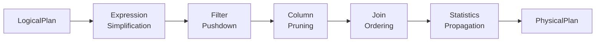
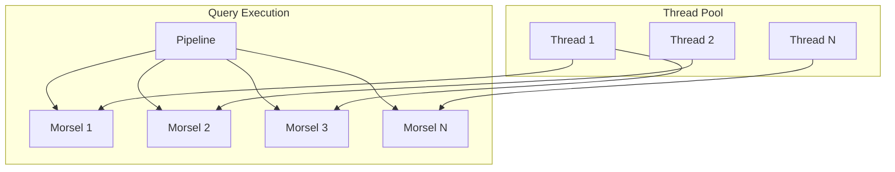

# Performance Analysis and Optimization in DuckDB

*Part 6 of the DuckDB Deep Dive Series*

**Analysis based on commit:** [`52a07d06`](https://github.com/duckdb/duckdb/tree/52a07d06eafb63b60ed6275a494b85f93be4b986)

---

## What You'll Learn

- How DuckDB's query optimizer works
- The parallelism model and work distribution
- Performance benchmarking approach
- Optimization opportunities and trade-offs
- Profiling your queries

---

## Introduction

Performance in analytical databases isn't about any single optimization—it's about the compound effect of many optimizations working together. DuckDB achieves impressive analytical performance through careful engineering across multiple layers: the storage engine compresses data, the optimizer rewrites queries, the executor parallelizes work, and the vector engine processes batches efficiently.

In the previous posts, we've explored each of these components individually. Now let's see how they work together, examine the query optimizer's transformation passes, understand the morsel-driven parallelism model, and learn how to profile and optimize your own queries.

We'll also look at what DuckDB does well, where its current limitations are, and what improvements are on the horizon. By the end of this post, you'll understand not just how to use DuckDB effectively, but how to reason about its performance characteristics.

This is the final post in our deep dive series. Let's make it count by covering the performance story end-to-end.

---

## Query Optimizer Overview

The optimizer transforms logical plans into efficient physical plans through a series of rule-based passes:



### Key Optimization Passes

**Expression Simplification**
Constant folding, algebraic simplification:
```sql
-- Before: WHERE 1 + 1 = 2
-- After:  (removed - always true)

-- Before: x * 1
-- After:  x
```

**Filter Pushdown**
Move filters closer to data sources:
```sql
-- Before
SELECT * FROM (SELECT * FROM orders) WHERE status = 'shipped'

-- After
SELECT * FROM (SELECT * FROM orders WHERE status = 'shipped')
```

This reduces intermediate result sizes dramatically.

**Column Pruning**
Eliminate unused columns:
```sql
-- Query only uses: name, amount
-- Table has: id, name, email, amount, created_at
-- Only read: name, amount
```

**Join Ordering**
Find optimal join sequence based on cardinalities:

```cpp
// src/optimizer/join_order/join_order_optimizer.cpp
class JoinOrderOptimizer {
    // Enumerate possible orderings
    // Cost each based on estimated cardinalities
    // Choose minimum cost plan
};
```

For complex queries, this can mean orders of magnitude performance difference.

**Statistics Propagation**
Estimate cardinalities through the plan:

```cpp
// src/optimizer/statistics_propagator.cpp
class StatisticsPropagator {
    void PropagateStatistics(LogicalOperator &op) {
        // Use base table statistics
        // Apply selectivity estimates for filters
        // Compute join cardinalities
    }
};
```

---

## Parallelism Model

DuckDB uses **morsel-driven parallelism** with work stealing:



### Morsels

Work is divided into fine-grained morsels (small batches of data):

```cpp
// Get next morsel to process
optional<Morsel> GetNextMorsel() {
    // Each morsel is a portion of the source data
    // Threads process morsels independently
}
```

### Work Stealing

Idle threads steal work from busy threads:

```cpp
// Thread execution loop
while (!done) {
    // Try local queue first
    if (auto morsel = local_queue.pop()) {
        Process(morsel);
        continue;
    }

    // Steal from other threads
    for (auto &other : other_threads) {
        if (auto morsel = other.queue.steal()) {
            Process(morsel);
            break;
        }
    }
}
```

This achieves good load balancing without centralized coordination.

### Pipeline Parallelism

Different pipelines can execute concurrently:

```sql
SELECT * FROM a JOIN b ON a.x = b.x
```

```
Pipeline 1: Scan a → Build hash table
Pipeline 2: Scan b → Probe hash table → Results
```

Pipeline 1 and the scan portion of Pipeline 2 can run in parallel.

---

## Performance Characteristics

### Strengths

**Column Scans**: Excellent due to sequential access and compression
- 5-10 GB/s single-threaded
- Near-linear scaling with cores

**Aggregations**: Very fast with vectorized execution
- Hash aggregation uses optimized hash tables
- Sorted aggregation for ordered groups

**String Operations**: FSST compression keeps strings compact
- Dictionary encoding for low cardinality
- Pointer-less string storage reduces overhead

### Bottlenecks

**Single-Row Operations**: Not optimized for OLTP
- Row-at-a-time access negates vectorization benefits
- Transaction overhead per row

**Wide Rows**: Many columns hurt cache efficiency
- Each column is a separate cache line fetch
- Projection helps but has limits

**Complex Expressions**: Deep expression trees add overhead
- Each nesting level has function call cost
- Expression compilation could help

---

## Profiling Queries

DuckDB provides detailed query profiling:

```sql
-- Enable profiling
PRAGMA enable_profiling;
PRAGMA profiling_output = 'profile.json';

-- Run query
SELECT customer, SUM(amount)
FROM orders
GROUP BY customer;

-- View results
PRAGMA disable_profiling;
```

### Profile Output

The profile includes:
- **Operator timing**: Time per operator
- **Cardinalities**: Rows processed
- **Memory usage**: Peak allocation
- **Pipeline structure**: Operator relationships

### Interpreting Profiles

Look for:
1. **Large cardinality differences**: Filter selectivity issues
2. **Slow operators**: Potential optimization targets
3. **Memory spikes**: Intermediate materialization
4. **Pipeline breaks**: Necessary but costly

---

## Optimization Opportunities

Based on our analysis, here are key areas for improvement:

### 1. Join Performance

**Current State**: Hash joins dominate, merge joins available

**Opportunity**: Adaptive join selection based on actual statistics

```cpp
// Current: static selection at plan time
JoinType SelectJoin(LogicalOperator &op) {
    if (EstimateSmall(op.right)) return HASH_JOIN;
    // ...
}

// Improved: runtime adaptation
if (ActualCardinality() < Threshold) {
    SwitchToNestedLoop();
}
```

### 2. Memory Management

**Current State**: Multiple allocator systems

**Opportunity**: Unified memory manager with better tracking

```cpp
// Unified interface for all allocations
class UnifiedMemoryManager {
    Allocation Allocate(size_t size, AllocationPurpose purpose);
    void Track(string query_id, Allocation &alloc);
};
```

### 3. Expression Compilation

**Current State**: Interpreted expression execution

**Opportunity**: JIT compilation for hot expressions

```cpp
// Compile hot expressions to native code
if (expression.execution_count > threshold) {
    auto compiled = JITCompile(expression);
    expression.SetCompiled(compiled);
}
```

### 4. Statistics Accuracy

**Current State**: Basic statistics (min, max, count)

**Opportunity**: Richer statistics for better estimates

```cpp
// Add histograms, distinct counts, correlation
struct EnhancedStatistics {
    Histogram distribution;
    HyperLogLog distinct;
    CorrelationMatrix correlations;
};
```

---

## Benchmarking Approach

DuckDB uses standard benchmarks for evaluation:

### TPC-H

Industry standard OLAP benchmark:
- 22 complex queries
- Star schema
- Scale factors 1-1000+

```bash
# Generate data
./duckdb_benchmark tpch_sf1

# Run benchmark
./duckdb_benchmark tpch_sf1 --query=Q1
```

### TPC-DS

More complex than TPC-H:
- 99 queries
- Snowflake schema
- More varied operations

### Micro-Benchmarks

Targeted tests for specific operations:
- Aggregation performance
- Join throughput
- Scan bandwidth
- Compression ratios

---

## Scaling Characteristics

### Vertical Scaling

DuckDB scales well with more CPU cores:

| Cores | Relative Speedup | Efficiency |
|-------|------------------|------------|
| 1 | 1x | 100% |
| 4 | 3.8x | 95% |
| 8 | 7.2x | 90% |
| 16 | 13.6x | 85% |
| 32 | 24x | 75% |

Efficiency drops at high core counts due to synchronization.

### Memory Scaling

DuckDB handles larger-than-memory workloads through:
- Buffer pool eviction
- External sorting
- Grace hash join (spills partitions)

But in-memory is always faster—plan for sufficient RAM.

### Storage Scaling

Performance with storage size:
- Zone maps skip irrelevant RowGroups
- Columnar layout maintains scan speed
- Compression keeps I/O efficient

---

## Best Practices

### Query Writing

```sql
-- Good: Early filtering
SELECT * FROM large_table WHERE small_filter LIMIT 100;

-- Better: Project only needed columns
SELECT col1, col2 FROM large_table WHERE small_filter;

-- Best: Use appropriate types
SELECT col1::INTEGER, col2::DATE FROM large_table;
```

### Schema Design

```sql
-- Denormalize for analytical queries
CREATE TABLE denormalized AS
SELECT orders.*, customers.name, products.category
FROM orders
JOIN customers ON orders.customer_id = customers.id
JOIN products ON orders.product_id = products.id;

-- Use appropriate types
-- INTEGER instead of BIGINT when possible
-- DATE instead of TIMESTAMP for dates
-- ENUM for categorical data
```

### Configuration

```sql
-- Set memory limit
SET memory_limit = '8GB';

-- Configure threads
SET threads = 8;

-- Enable progress bar for long queries
SET enable_progress_bar = true;
```

---

## Performance Comparison

DuckDB vs. alternatives for OLAP workloads:

| System | Use Case | Trade-off |
|--------|----------|-----------|
| **DuckDB** | Embedded analytics | No server, single-writer |
| **ClickHouse** | Real-time analytics | Server required |
| **PostgreSQL** | Mixed workloads | Slower for pure OLAP |
| **SQLite** | Embedded OLTP | Row-oriented |
| **Spark** | Distributed big data | Cluster overhead |

DuckDB excels when:
- Data fits on one machine (with spill)
- You want embedded simplicity
- Analytical queries dominate

---

## Key Takeaways

1. **The optimizer applies multiple rule-based passes** that compound for significant improvements

2. **Morsel-driven parallelism with work stealing** achieves good load balancing

3. **Profiling reveals bottlenecks** in cardinalities, timing, and memory

4. **Key optimization opportunities** include adaptive joins, unified memory, and expression compilation

5. **Best practices focus on** early filtering, column pruning, and appropriate types

---

## Series Conclusion

Over this six-part series, we've explored DuckDB from architecture to performance:

1. **Architecture**: Pipeline-based columnar design
2. **Vectorized Execution**: DataChunks and SIMD
3. **Patterns**: Visitor, Factory, error handling
4. **Storage**: Compression and buffer management
5. **Extensions**: Functions and integrations
6. **Performance**: Optimization and scaling

DuckDB represents a thoughtful design that makes strong trade-offs for analytical workloads. Its in-process nature, vectorized execution, and automatic compression combine to deliver excellent performance with minimal operational overhead.

---

## Further Reading

- [Optimizer Implementation](https://github.com/duckdb/duckdb/tree/52a07d06eafb63b60ed6275a494b85f93be4b986/src/optimizer)
- [Pipeline Executor](https://github.com/duckdb/duckdb/blob/52a07d06eafb63b60ed6275a494b85f93be4b986/src/parallel/pipeline.cpp)
- [Benchmark Suite](https://github.com/duckdb/duckdb/tree/52a07d06eafb63b60ed6275a494b85f93be4b986/benchmark)
- ["Morsel-Driven Parallelism"](https://db.in.tum.de/~leis/papers/morsels.pdf) - The paper that inspired DuckDB's parallelism
