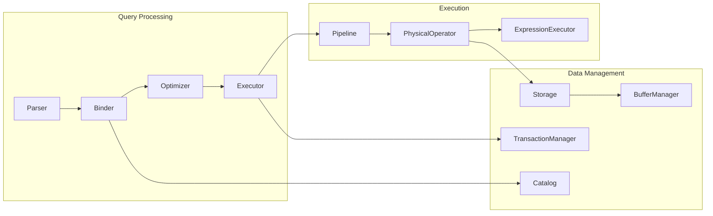

# DuckDB Dependency Analysis

**Commit SHA:** `52a07d06eafb63b60ed6275a494b85f93be4b986`

---

## Dependency Overview

DuckDB bundles all dependencies in `third_party/` to ensure:
- Zero external runtime dependencies
- Consistent builds across platforms
- No version conflicts with system libraries

**Total Dependencies:** 30
**License Profile:** Permissive (MIT, BSD, Apache 2.0)

---

## Dependency Catalog

### Core Parsing & Processing

| Library | Version | License | Purpose | Critical? |
|---------|---------|---------|---------|-----------|
| libpg_query | N/A | BSD-3 | PostgreSQL SQL parser | Yes |
| re2 | N/A | BSD-3 | Regular expression engine | Yes |
| utf8proc | 2.6.1 | MIT | Unicode normalization | Yes |
| fmt | 8.1.1 | MIT | String formatting | Yes |

### Compression Algorithms

| Library | Version | License | Purpose | Compression Ratio |
|---------|---------|---------|---------|-------------------|
| zstd | 1.5.6 | BSD/GPL | General compression | High |
| lz4 | N/A | BSD-2 | Fast compression | Medium |
| miniz | 3.0.2 | MIT | ZIP/DEFLATE | Medium |
| snappy | N/A | BSD-3 | Fast compression | Low |
| fsst | N/A | MIT | String compression | High (strings) |
| fastpforlib | N/A | Apache-2.0 | Integer compression | High (integers) |

### Data Formats

| Library | Version | License | Purpose |
|---------|---------|---------|---------|
| yyjson | N/A | MIT | Fast JSON parsing |
| fast_float | N/A | MIT/Apache-2.0 | Float string parsing |
| miniparquet | N/A | MIT | Parquet support |

### Networking & Security

| Library | Version | License | Purpose |
|---------|---------|---------|---------|
| mbedtls | 3.6.4 | Apache-2.0/GPL | TLS/SSL, cryptography |
| httplib | N/A | MIT | HTTP client/server |
| openssl | N/A | Apache-2.0 | OpenSSL compatibility |

### Utilities

| Library | Version | License | Purpose |
|---------|---------|---------|---------|
| hyperloglog | N/A | MIT | Cardinality estimation |
| pcg | N/A | MIT | Random number generation |
| tdigest | N/A | Apache-2.0 | Approximate percentiles |
| concurrentqueue | N/A | BSD | Lock-free queue |
| jaro_winkler | N/A | MIT | String similarity |

### Platform Support

| Library | Purpose |
|---------|---------|
| libpg_query | Platform-independent parser |
| imdb | Intel Memory Database |

---

## Dependency Graph

```mermaid
graph TB
    subgraph "Core Engine"
        DuckDB[DuckDB Core]
    end

    subgraph "Parsing"
        libpg[libpg_query]
        re2[RE2]
        utf8[utf8proc]
    end

    subgraph "Compression"
        zstd[zstd]
        lz4[LZ4]
        miniz[miniz]
        snappy[Snappy]
        fsst[FSST]
        fastpfor[FastPFOR]
    end

    subgraph "Data Formats"
        yyjson[yyjson]
        fastfloat[fast_float]
        parquet[miniparquet]
    end

    subgraph "Security"
        mbedtls[mbedTLS]
        httplib[httplib]
    end

    subgraph "Utilities"
        fmt[fmt]
        hll[HyperLogLog]
        pcg[PCG]
    end

    DuckDB --> libpg
    DuckDB --> re2
    DuckDB --> utf8
    DuckDB --> zstd
    DuckDB --> lz4
    DuckDB --> miniz
    DuckDB --> snappy
    DuckDB --> fsst
    DuckDB --> fastpfor
    DuckDB --> yyjson
    DuckDB --> fastfloat
    DuckDB --> parquet
    DuckDB --> mbedtls
    DuckDB --> httplib
    DuckDB --> fmt
    DuckDB --> hll
    DuckDB --> pcg
```



---

## Internal Component Dependencies



---

## License Analysis

### License Distribution

| License | Count | Libraries |
|---------|-------|-----------|
| MIT | 14 | fmt, utf8proc, miniz, fsst, yyjson, httplib, hyperloglog, pcg, jaro_winkler, etc. |
| BSD-3 | 6 | libpg_query, re2, snappy, etc. |
| BSD-2 | 2 | lz4, etc. |
| Apache-2.0 | 4 | mbedtls, fastpforlib, tdigest, etc. |
| Dual (GPL/BSD) | 2 | zstd |

### Commercial Use Assessment

**Status:** ✅ Safe for proprietary use

All core dependencies use permissive licenses. The GPL option in dual-licensed libraries (zstd) is not required - BSD/Apache alternatives are available.

**Considerations:**
- Attribution required for BSD/MIT/Apache licensed code
- Apache 2.0 patent grant clauses may affect patent-sensitive projects
- Keep track of license files in distribution

---

## Security Assessment

### Recent Vulnerabilities

| Library | Version | Known CVEs | Status |
|---------|---------|------------|--------|
| mbedtls | 3.6.4 | None recent | ✅ Current |
| zstd | 1.5.6 | None recent | ✅ Current |
| libpg_query | N/A | None known | ✅ OK |
| fmt | 8.1.1 | None known | ⚠️ Update available |

### Security Features

- mbedTLS 3.6.4 supports TLS 1.3
- AddressSanitizer enabled by default in debug builds
- UndefinedBehaviorSanitizer enabled by default

---

## Update Recommendations

### High Priority

| Library | Current | Latest | Reason |
|---------|---------|--------|--------|
| fmt | 8.1.1 | 10.x | Performance, features |

### Low Priority

Libraries with no known issues and stable APIs can remain at current versions.

---

## Dependency Weight Analysis

### By Binary Size Contribution

1. **libpg_query** - Large (PostgreSQL parser)
2. **re2** - Medium (regex engine)
3. **zstd** - Medium (compression)
4. **mbedtls** - Medium (TLS stack)
5. **Others** - Small (< 100KB each)

### Potential Lightweight Alternatives

| Current | Alternative | Trade-off |
|---------|-------------|-----------|
| re2 | PCRE2 | RE2 has guaranteed O(n) time |
| zstd | lz4 only | zstd has better ratio |
| yyjson | simdjson | yyjson is simpler |

**Recommendation:** Current choices are well-optimized for DuckDB's use cases. No changes recommended.

---

## Build Integration

### CMake Options for Dependencies

```cmake
# Disable specific dependencies
-DDISABLE_PARQUET=TRUE
-DDISABLE_JSON=TRUE

# Use system libraries instead
-DUSE_SYSTEM_ZSTD=TRUE
-DUSE_SYSTEM_LZ4=TRUE

# Extension control
-DBUILD_EXTENSIONS="parquet;json;icu"
```

### Dependency Compilation

All third-party code is compiled as static libraries with hidden symbols:
- Prevents symbol conflicts
- Enables link-time optimization
- Reduces binary size through dead code elimination
